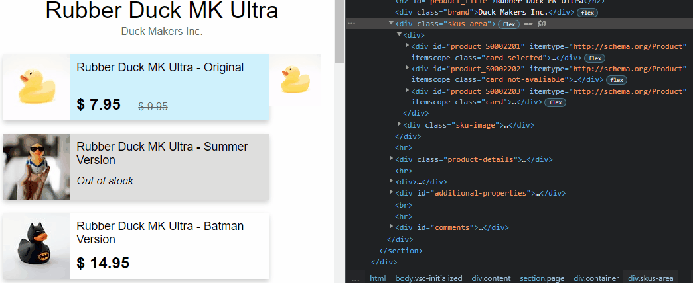
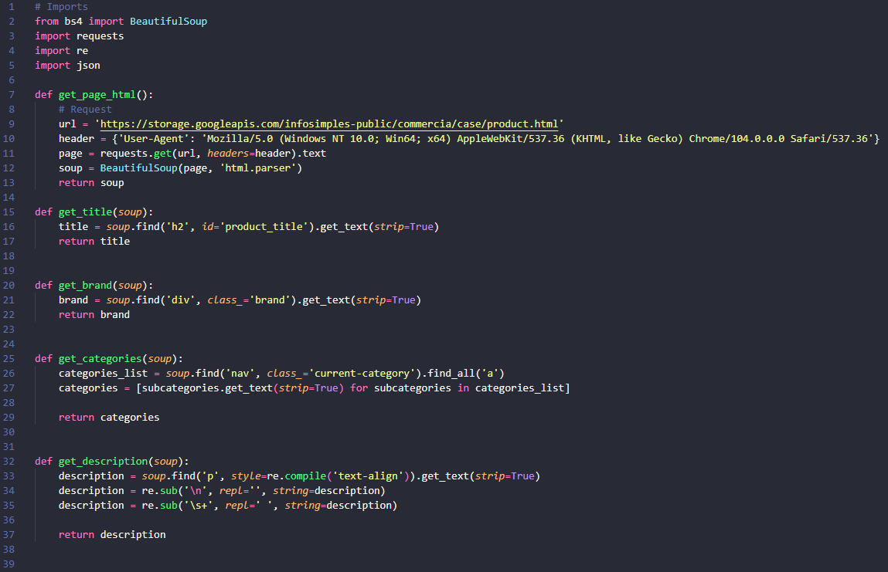
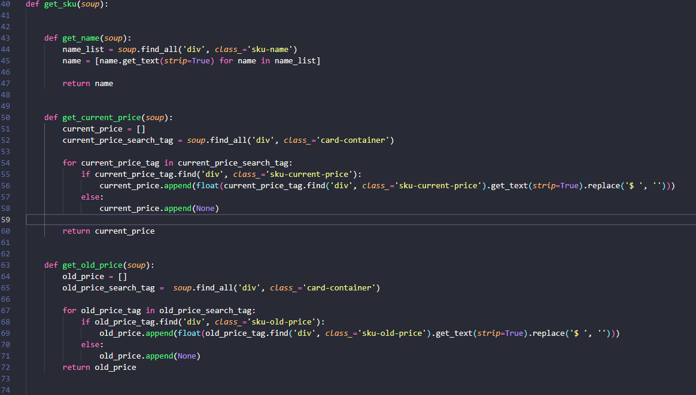
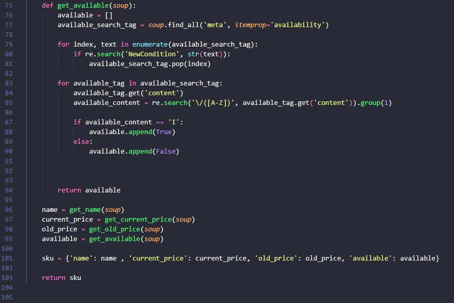
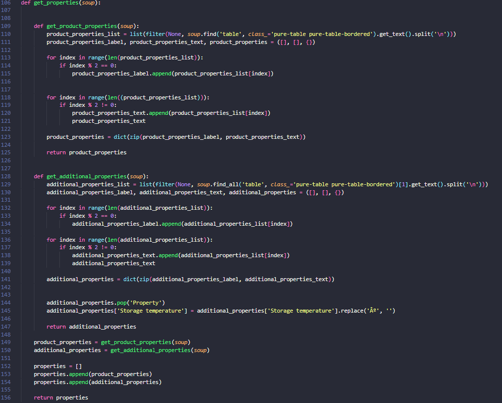
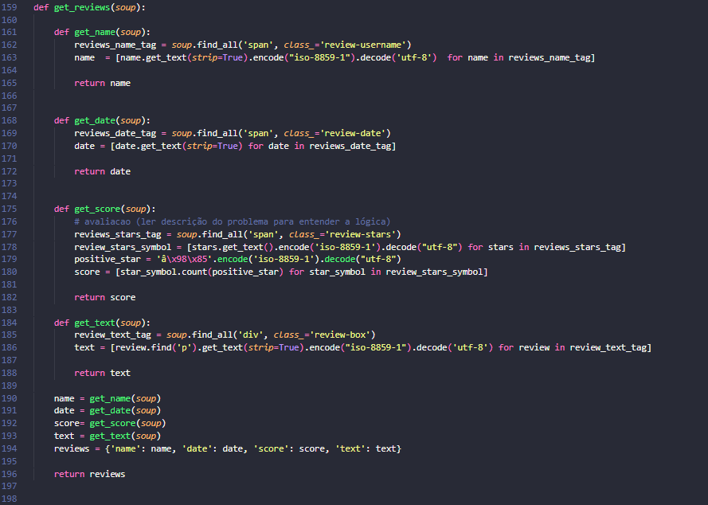
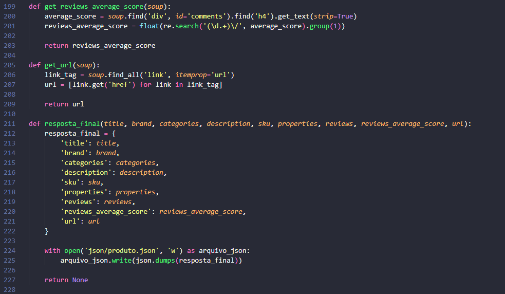
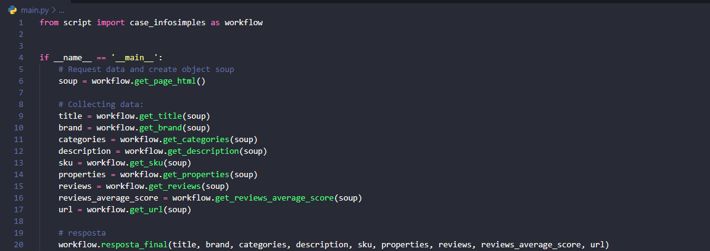

# Take-Home Coding Challenge

### Demo 📷
<h1 align="center">
  
</h1>

# Tabela de conteudos  
- [Take-Home Coding Challenge](#take-home-coding-challenge)
    - [Demo 📷](#demo-)
- [Tabela de conteudos](#tabela-de-conteudos)
  - [Sobre o projeto](#sobre-o-projeto)
  - [Tecnologias](#tecnologias)
  - [Serviços utilizados](#serviços-utilizados)
- [Explicação do código](#explicação-do-código)
  - [1 - Primeira parte (request/parse/soup, title, brand, categories, description)](#1---primeira-parte-requestparsesoup-title-brand-categories-description)
  - [2 - Segunda parte (sku)](#2---segunda-parte-sku)
    - [2.1 - Parte 1](#21---parte-1)
    - [2.2 - Parte 2](#22---parte-2)
  - [3 - Terceira parte (properties)](#3---terceira-parte-properties)
  - [4 - Quarta parte (reviews)](#4---quarta-parte-reviews)
  - [5 - Quinta parte (review_average_score, url)](#5---quinta-parte-review_average_score-url)
  - [6 - Sexta parte ()](#6---sexta-parte-)
  - [Finalidades](#finalidades)
  - [Links](#links)
  - [Considerações finais](#considerações-finais)
  - [Autor](#autor)
  
---

## Sobre o projeto 

Esse projeto é parte do processo seletivo para a empresa Infosimples, empresa especializada em desenvolvimento de projetos de Web Scraping e Inteligência Artificial. O projeto se baseia no scraping de uma página web projetada para simular um e-commerce, possuindo uma vitrine de produtos com diversas características, como Título, Categoria, Preço, etc. O objetivo do projeto é realizar o scraping dessas características encontradas na página para então salva-las em um arquivo "produtos.json".

---

## Tecnologias 

Aqui estão as tecnologias usadas nesse projeto.

* Python version  3.10.4
* Visual Studio Code
* Anaconda 

---

## Serviços utilizados

* Github

---

# Explicação do código

## 1 - Primeira parte (request/parse/soup, title, brand, categories, description)
Imports, Requisição HTTP, utilização do html.parser, instanceamento do objeto soup a partir da classe BeaultifulSoup() e definição de algumas funções que extraem determinados dados da página. A maior complexidade nessa parte do código se da  na função get_description() onde eu utilizo regex para limpar algumas sujeiras do texto coletado, como '\n' e espaços duplicados.

<h2 align="center">
  
</h2>

---

## 2 - Segunda parte (sku)
Definindo a função que ira me retornar uma lista contendo as informações do sku.
A função a seguir ficou muito grande então dividi em dois prints para melhor visualização.

  ### 2.1 - Parte 1 
  Há alguns produtos que possuem um valor para a tag (div class='sku-current-price') enquanto um outro retorna null (porque ele esta fora de estoque), então para evitar erros, eu utilizei uma condição if para verificar se a busca por essa tag retornava algum valor ou não e com base nisso fazer um append para a lista que irá conter os valores, sendo preenchida com 'None' caso não possua um valor para current_price. E eu também fiz uma limpeza dos dados retirando o cifrão e convertendo a string para float.

  A mesma lógica foi utilizada para old_price !!

  <h2 align="center">
  
  </h2>
  
  ### 2.2 - Parte 2
  2.2.1- Para saber se o produto estava disponivel ou não em estoque eu percebi que existia uma tag (meta itemprop='availability') que possui um parâmetro chamado content onde se encontra um link em que o endpoint dele é o indicativo para se existe o produto está ou não disponivel em estoque. Coletei todas essas tags e utilizei uma regex para excluir todas as tags em que possuem o endpoint do parâmetro como "NewCondition" pois isso atrapalharia meu raciocínio  seguinte. 
  2.2.2 - Agora com uma lista contendo apenas as tags desejadas, eu apliquei uma regex onde ela selecionava a primeira palavra do endpoint, caso ela fosse I significa que estava em estoque, porque vinha de "InStock", caso não fosse I a primeira letra, então vinha de 'OutOfStock', logo não estava em estoque. 
  2.2.3 - Fiz a chamada das funções internas da função get_sku() para atribuir às variáveis e armazena-las em um dicionário o qual atribui para ser o retorno da função.

  <h2 align="center">
  
  </h2>

---

## 3 - Terceira parte (properties)
Aviso!! A mesma lógica para get_product_properties() é a de get_additional_properties(). Definindo a função que coleta as propriedades do produto. Bem, essa parte eu fiquei muito em dúvida se eu retornaria duas listas, uma contendo todas as labels, e na outra os textos dessas labels, ou se era tudo em uma lista só. Porém ambos os formatos pareciam ruins e não legíveis para mim, então como eu estou acostumado a utilizar a biblioteca pandas e visualizar tabelas como dicionários, eu coletei as propriedades dessa forma, fazendo chave: valor para label: text. A lógica foi de coletar o texto da primeira tag 'pure-table pure-table-bordered' e fazer uma limpeza nele, utilizando o split('\n') para eliminar as sujeiras e um filter para retirar os valores nulos que ficaram no lugar dos \n deixado pelo split. Então eu recebia como saída dessa coleta uma lista contendo todas as informações da tabela, porém de forma unidimensional e intercalada onde os index ímpares eram os textos e os pares as labels, e seguindo essa lógica eu utilizei uma condição onde se o index fosse impar ele coletava esse elemento para uma lista que armazenava os textos e se fosse par armazenava para labels. Com as duas listas finalizadas eu criava um dicionário onde ele atribui chave:valor para o os elementos com mesma posição na lista.
  O retorno era : [Color, Various, Material, Rubber, Shape, Ducky, Size, Medium, Weight, 1.5 Kg, Radioactivity Level, Low] 
Eu fiz:  
labels = [Color, Material, Shape, Size, Weight, Radioactivity Level] 
text = [Various, Rubber, Ducky, Medium, 1.5 kg, Low]

Então utilizei a função zip() para criar o dicionário com elas.

Com os dicionários feitos (Um para product_properties e outro para additional_properties (pois sao 2 tabelas diferentes)) eu inseri eles em uma lista e retornei como valor da função.

Obs1: A função zip cria um objeto zip em memoria onde ele assimila 2 elementos de dois iteráveis com base nos seus índices serem iguais. E depois eu converti esse objeto em memória para um dicionário. 
Obs2: Para get_additional_properties() eu fiz um pop para dropar o cabeçalho que foi coletado da tabela e não era de interesse. E uma limpeza para retirar o caractere º pois estava dando problema de enconding.

<h2 align="center">
  
</h2>

## 4 - Quarta parte (reviews)
4.1- A função get_reviews() coleta as informações a respeito dos reviews e armazena em uma lista. Dentro de get_reviews() na função get_name() eu tentei utilizar o encode("iso-8859-1").decode('utf-8') para trata o problema de enconding que estava tendo na saída por causa de acentos no nome do Kairo Josué, dentro do programa deu certo, caso você printe os nomes, porém depois quando salvou no arquivo produtos.json voltou a dar problema, mas deixei assim. Pois foi bom eu ter utilizado nesse primeiro momento essa técnica do enconding, já que ela que me levou a conseguir resolver o problema de como coletar as avaliações das estrelas. 
 4.2 - **get_stars()** essa foi a parte mais difícil em questão de lógica dentro do código para mim. Depois de estudar um pouco e ver alguns vídeos, eu utilizei os métodos encode("iso-8859-1").decode('utf-8') e descobri um padrão, o padrão era que 'â\x98\x85' significava uma estrela preenchida, ou seja, positiva, então eu defini que positive_star = 'â\x98\x85'.encode("iso-8859-1").decode('utf-8'), então no laço for para percorrer todas as avaliações coletadas eu utilizei o método count() onde eu recebo como retorno a quantidade de vezes em que a estrela positiva foi encontrada em cada avaliação!!! 
  4.3- Para coleta dos textos, apenas utilizei o encode para evitar erros com acentos. Porém como aconteceu nom os nomes, quando salvo no arquivo produtos.json acabou dando problema novamente. 4.4- Com todos os dados coletados, eu chamei as funções e retornei seus valores, e armazenei em um dicionário como retorno de get_reviews()

<h2 align="center">
  
</h2>

---

## 5 - Quinta parte (review_average_score, url)
5.1- A função get_revies_average_score() utiliza de um regex para retirar apenas o número e fazer um cast para o tornar inteiro. 
5.2- A função get_url() coleta as urls, sem complexidade 
5.3- É definido então a resposta_final(), recebendo todos os valores para a criação do dicionário e posterior escrita do arquivo produtos.json

<h2 align="center">
  
</h2>

---

## 6 - Sexta parte ()
Essa é a parte onde eu realizo a chamada de todas as funções para o script, é onde eu coloquei o código em produção. Provavelmente pode haver algum erro ou má pratica, porém eu ainda estou estudando e aprendendo sobre ETL, e esse é o corpo que ele ficou, com isso o código está funcionando normalmente e modularizado. 

<h2 align="center">
  
</h2>

---

## Finalidades
As principais finalidade dessa aplicação são:
 - Raspagem de dados de um website 
 - Armazenar os dados coletados em um arquivo JSON

---

## Links
  - Repositorio: https://github.com/Junior-Prestes-Nogueira/Infosimples_case

---

## Considerações finais
Durante todo o pensamento analítico para criação desse código, eu tive a ideia  que deveria realizar um scraping para uma página não estática e que poderia receber mudanças o tempo todo, como alteração no valor dos produtos, preços, descrição, etc. Tanto que eu comecei a fazer o projeto pensando em ter como saída um arquivo produtos.json contendo um objeto json para cada produto, tendo chave:valor sendo representado por id do produto e seu conteúdo de caracteristicas, porem eu acabei não fazendo assim por incerteza se seria recusado por conta do modelo de saída ser diferente. 

--- 

## Autor

**Junior Prestes Nogueira** 

Obrigado pela atenção e pela oportunidade de resolver o case!!

---